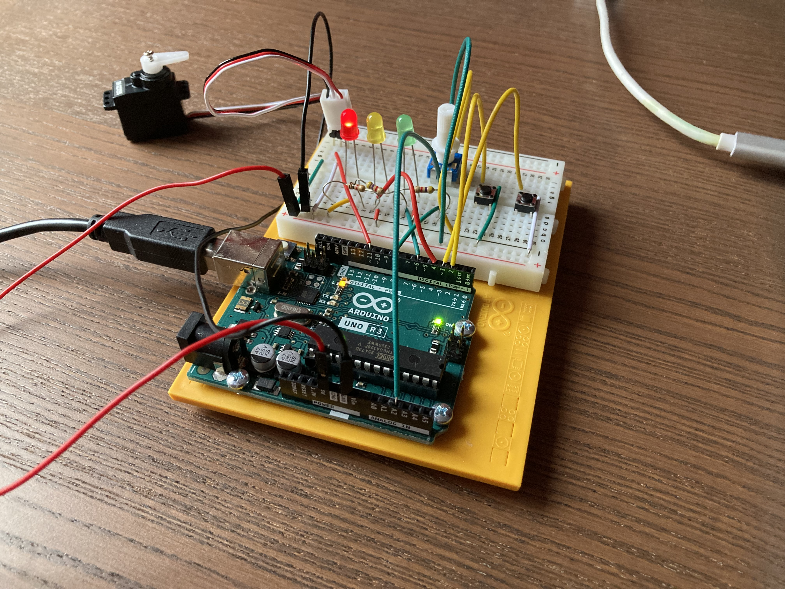

# Arduino Landing Gear Control System

## Images

## Overview

This project simulates a simplified aircraft landing gear control system using an Arduino Uno. The system combines a finite state machine, servo-controlled landing gear actuation, airspeed monitoring, fault detection, fault recovery, and visual status indication.

The project was developed as an embedded systems learning project and demonstrates how hardware and software components can be integrated into a realistic control system.

---

## Hardware

* Arduino Uno
* Breadboard
* Servo Motor
* Potentiometer
* 2 Push Buttons
* 3 LEDs (Red, Yellow, Green)
* Resistors
* Jumper Wires

---

## Pin Configuration

| Component            | Arduino Pin |
| -------------------- | ----------- |
| Gear Control Button  | D2          |
| Fault Reset Button   | D3          |
| Red LED              | D4          |
| Yellow LED           | D6          |
| Green LED            | D8          |
| Servo Signal         | D11         |
| Potentiometer Signal | A2          |

---

## Features

### Landing Gear Control

* Landing gear extension
* Landing gear retraction
* Servo-based gear movement simulation

### Airspeed Monitoring

* Potentiometer-based airspeed simulation
* Airspeed range: 0–250 knots

### Safety Logic

* Prevents gear retraction below the minimum required airspeed
* Visual warning indication for blocked retraction attempts

### Fault Detection

* Landing gear movement timeout detection
* Dedicated fault state management

### Fault Recovery

* Dedicated reset button
* Automatic recovery procedure
* Safe gear extension after fault recovery

### Visual Status Indicators

| LED State               | Meaning                    |
| ----------------------- | -------------------------- |
| Red                     | Gear Retracted             |
| Yellow                  | Gear Moving                |
| Green                   | Gear Extended              |
| Red + Yellow Blinking   | Gear Fault                 |
| Green + Yellow Blinking | Retraction Blocked Warning |

---

## State Machine

The controller uses the following states:

* `GEAR_RETRACTED`
* `GEAR_EXTENDING`
* `GEAR_EXTENDED`
* `GEAR_RETRACTING`
* `GEAR_FAULT`

---

## Skills Demonstrated

* Embedded Systems Programming
* Finite State Machine Design
* Sensor Integration
* Servo Motor Control
* Fault Detection and Recovery
* Safety-Critical Logic
* Hardware Prototyping
* Arduino Development
* Git and GitHub Workflow

---

## Testing

The following scenarios have been successfully tested on physical hardware:

* Normal gear extension
* Normal gear retraction
* Airspeed-based retraction blocking
* Fault detection
* Fault recovery
* Visual warning indications
* Servo operation
* Potentiometer integration

---

## Project Status

✅ Version 1.0 Complete

Core functionality has been implemented, tested, and validated on physical hardware.

---

## Future Improvements

Potential future enhancements include:

* LCD-based user interface
* Audible warning system
* Startup self-test routine
* Additional fault conditions
* Advanced diagnostic information

